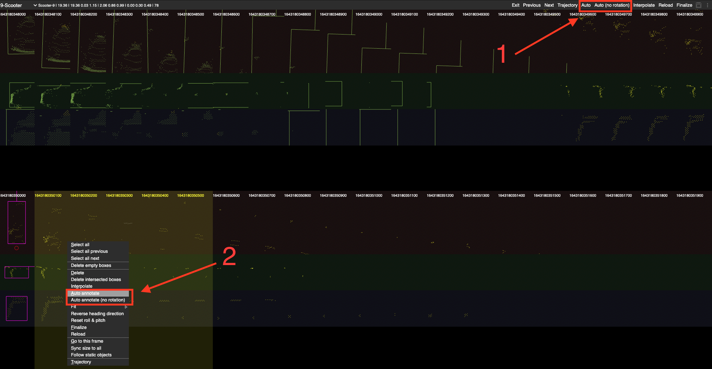

# SUSTechPOINTS: Point Cloud 3D Bounding Box Annotation Tool For Autonomous Driving
This is the tool we will be using for annotating data. 

## Downloading bin files 

**Method 1:**

- Instructions on setting up file transfer can be found [here](https://docs.google.com/document/d/10QmpV0-8-sQTcIEvfgU8UzU3qZ8N_S5xbMDKM9frzfI/edit#). But in short:
```bin
ssh -L 4321:129.215.90.110:22 <DICE username>@ssh.inf.ed.ac.uk
```
then in another terminal 
```bin
scp -r -P 4321 <server username>@127.0.0.1:/file/on/the/server /local/directory
```


- The point clouds are located in `/mnt/12T/public/shangqi/data_0401/lidar/kitti_format/lidar` on the server. to get all the files for a sequence, you can do the following (perhaps theres a more efficient way, but here's how I did it). 

1. Run the following commands

```bash
cd /home/{user} 
mkdir seq_XX
xargs -I % --arg-file=/home/gabriel/seq_bin/seq_XX.txt cp /mnt/12T/public/shangqi/data_0401/lidar/kitti_format/lidar/% /home/{user}/seq_XX/
zip -r seq_XX.zip seq_XX
```

where `seq_XX` is your assigned sequence, so `seq_00` for example, and `{user}` is your user directory. Running the above commands once should give you a zip folder containing all frames for one sequence. Repeat until you have all your sequences. Then transfer the zips back to your local machine.

**Method 2**

You can also download the separated sequence data directly on the server in ```/mnt/12T/public/labeling/seq_data```

## USING THE TOOL
there is also a detailed explaination in the [chinese README](README_cn.md)

### Main UI


### Automatic yaw angle (z-axis) prediction.
example of labelling a car: Holding Ctrl, draw a rectangle enclosing the object.


### batch-mode box editing

this tool also has semi-auto-annotation. Once you have drawn a bounding box for an object you can enter batch mode editing like so


or by right clicking an object and clicking `edit multiple instances`. Here, you can use the auto annotation function to label the object throughout the entire sequence (1). Or you can select frames and selectively auto annotate. 



**NOTE:** the tool relies on existing boxes to label unannotated frames, so it will preform better if the obj is labelled in a few frames. You can copy a bounding box and paste it in another frame. To ensure that the box size is the same, you can select `sync size to all` (3). 

**NOTE2:** If an object has very few points/ambiguous throughout the entire sequence, you can ignore it. 

## Installation

[Docker](./doc/docker.md)

[Install from source](./doc/install_from_source.md)

[uwsgi](./doc/deploy_server.md)


### FILE STRUCTURE

`.bin` files should be inside a folder named lidar as illustrated below. You will have to create an empty `label` directory, this is where the `json` files for the labels are generated. 

```bash
.
├── Docker
├── __pycache__
├── algos
│   ├── __pycache__
│   └── models
├── calibpy
├── data
│   └── seq_XX
│       ├── label <-- CREATE THIS FOLDER 
│       └── lidar <-- FOLDER CONTAINING .bin FILES
│       
├── doc
├── public
└── tools
```


## Operations

[Operations](./doc/operations.md)
[Shortcuts(中文)](./doc/shortcuts_cn.md)


## Cite

If you find this work useful in your research, please consider cite:
```
@INPROCEEDINGS{9304562,
  author={Li, E and Wang, Shuaijun and Li, Chengyang and Li, Dachuan and Wu, Xiangbin and Hao, Qi},
  booktitle={2020 IEEE Intelligent Vehicles Symposium (IV)}, 
  title={SUSTech POINTS: A Portable 3D Point Cloud Interactive Annotation Platform System}, 
  year={2020},
  volume={},
  number={},
  pages={1108-1115},
  doi={10.1109/IV47402.2020.9304562}}
  
```
