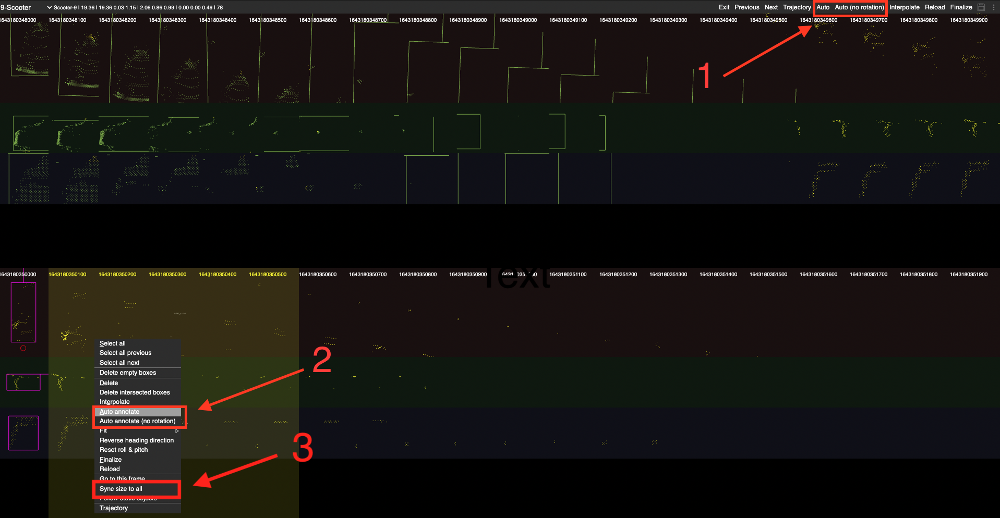

# SUSTechPOINTS: Point Cloud 3D Bounding Box Annotation Tool For Autonomous Driving
This is the tool we will be using for annotating data. 

### Main UI


### Automatic yaw angle (z-axis) prediction.
example of labelling a car: Holding Ctrl, draw a rectangle enclosing the object.


### batch-mode box editing

this tool also has semi-auto-annotation. Once you have drawn a bounding box for an object you can enter batch mode editing like so


or by right clicking an object and clicking `edit multiple instances`. Here, you can use the auto annotation function to label the object throughout the entire sequence (1). Or you can select frames and selectively auto annotate. 



**NOTE:** the tool relies on existing boxes to label unannotated frames, so it will preform better if the obj is labelled in a few frames. You can copy a bounding box and paste it in another frame. To ensure that the box size is the same, you can select `sync size to all` (3). 

**NOTE2:** If an object has very few points/ambiguous throughout the entire sequence, you can ignore it. 

## Installation

[Docker](./doc/docker.md)

[Install from source](./doc/install_from_source.md)

[uwsgi](./doc/deploy_server.md)

## Operations

[Operations](./doc/operations.md)
[Shortcuts(中文)](./doc/shortcuts_cn.md)


## Cite

If you find this work useful in your research, please consider cite:
```
@INPROCEEDINGS{9304562,
  author={Li, E and Wang, Shuaijun and Li, Chengyang and Li, Dachuan and Wu, Xiangbin and Hao, Qi},
  booktitle={2020 IEEE Intelligent Vehicles Symposium (IV)}, 
  title={SUSTech POINTS: A Portable 3D Point Cloud Interactive Annotation Platform System}, 
  year={2020},
  volume={},
  number={},
  pages={1108-1115},
  doi={10.1109/IV47402.2020.9304562}}
  
```
